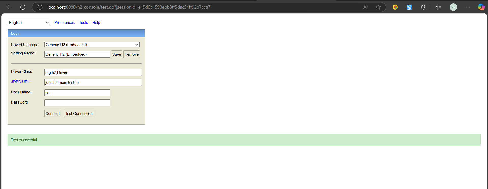
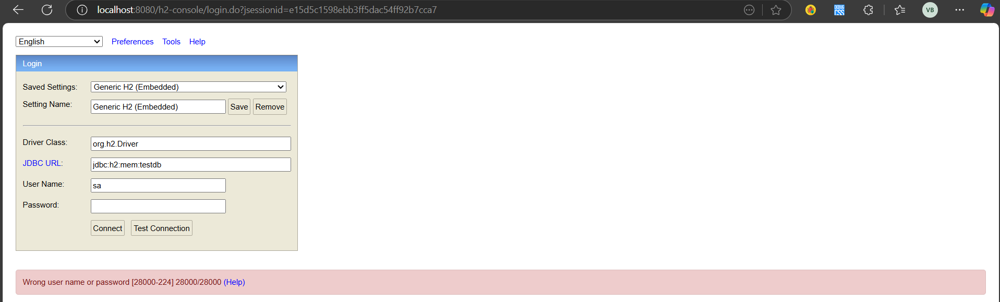

# Day 3: Spring Security & Authentication

## Objective

Implement security features, authentication, and authorization using Spring Security with proper role-based access control.

---

## Concepts Covered

### 1. Spring Security Overview

Spring Security is a powerful and customizable authentication and access-control framework. It handles:
- User authentication
- Password encryption
- Role-based authorization
- Protection against attacks like CSRF and session fixation

---

### 2. Security Configuration

In Spring Security 6+, the configuration uses lambdas instead of chained `.disable()` calls.

```java
@Configuration
public class SecurityConfig {

    @Bean
    public SecurityFilterChain securityFilterChain(HttpSecurity http) throws Exception {
        http
            .authorizeHttpRequests(auth -> auth
                .requestMatchers("/auth/**", "/h2-console/**").permitAll()
                .anyRequest().authenticated()
            )
            .csrf(csrf -> csrf.disable())
            .headers(headers -> headers.frameOptions(frame -> frame.disable()))
            .sessionManagement(sess -> sess.sessionCreationPolicy(SessionCreationPolicy.STATELESS));

        return http.build();
    }

    @Bean
    public PasswordEncoder passwordEncoder() {
        return new BCryptPasswordEncoder();
    }

    @Bean
    public AuthenticationManager authenticationManager(AuthenticationConfiguration config) throws Exception {
        return config.getAuthenticationManager();
    }
}
```

---

### 3. Password Encoding

```java
@Bean
public PasswordEncoder passwordEncoder() {
    return new BCryptPasswordEncoder();
}
```

- BCrypt is a strong one-way hashing function used to securely store passwords.

---

### 4. User Entity

```java
@Entity
public class User {
    @Id
    @GeneratedValue(strategy = GenerationType.IDENTITY)
    private Long id;
    private String username;
    private String password;
    private String role;
}
```

---

### 5. User Repository

```java
@Repository
public interface UserRepository extends JpaRepository<User, Long> {
    Optional<User> findByUsername(String username);
}
```

---

### 6. Register Endpoint

```java
@RestController
@RequestMapping("/auth")
public class AuthController {

    @Autowired
    private UserRepository userRepository;

    @Autowired
    private PasswordEncoder passwordEncoder;

    @PostMapping("/register")
    public String register(@RequestBody User user) {
        user.setPassword(passwordEncoder.encode(user.getPassword()));
        userRepository.save(user);
        return "User registered successfully";
    }
}
```

---

## JWT Authentication

### 7. What is JWT?

JWT (JSON Web Token) is a compact, URL-safe token that is used to securely transmit information between parties. It's used in stateless authentication mechanisms.

---

### 8. Add JWT Dependency

In `pom.xml`:

```xml
<dependency>
    <groupId>io.jsonwebtoken</groupId>
    <artifactId>jjwt</artifactId>
    <version>0.9.1</version>
</dependency>
```

---

### 9. Create JWT Utility

```java
@Component
public class JwtUtil {

    private final String SECRET_KEY = "secret";

    public String generateToken(UserDetails userDetails) {
        return Jwts.builder()
            .setSubject(userDetails.getUsername())
            .setIssuedAt(new Date(System.currentTimeMillis()))
            .setExpiration(new Date(System.currentTimeMillis() + 1000 * 60 * 60 * 10)) // 10 hrs
            .signWith(SignatureAlgorithm.HS256, SECRET_KEY)
            .compact();
    }

    public Boolean validateToken(String token, UserDetails userDetails) {
        final String username = extractUsername(token);
        return (username.equals(userDetails.getUsername()) && !isTokenExpired(token));
    }

    public String extractUsername(String token) {
        return extractClaims(token).getSubject();
    }

    public boolean isTokenExpired(String token) {
        return extractClaims(token).getExpiration().before(new Date());
    }

    private Claims extractClaims(String token) {
        return Jwts.parser().setSigningKey(SECRET_KEY).parseClaimsJws(token).getBody();
    }
}
```

---

### 10. JWT Filter

```java
@Component
public class JwtRequestFilter extends OncePerRequestFilter {

    @Autowired
    private UserDetailsService userDetailsService;

    @Autowired
    private JwtUtil jwtUtil;

    @Override
    protected void doFilterInternal(HttpServletRequest request, HttpServletResponse response, FilterChain chain)
            throws ServletException, IOException {
        final String authHeader = request.getHeader("Authorization");

        String username = null;
        String jwt = null;

        if (authHeader != null && authHeader.startsWith("Bearer ")) {
            jwt = authHeader.substring(7);
            username = jwtUtil.extractUsername(jwt);
        }

        if (username != null && SecurityContextHolder.getContext().getAuthentication() == null) {
            UserDetails userDetails = this.userDetailsService.loadUserByUsername(username);

            if (jwtUtil.validateToken(jwt, userDetails)) {
                UsernamePasswordAuthenticationToken authToken =
                        new UsernamePasswordAuthenticationToken(userDetails, null, userDetails.getAuthorities());
                authToken.setDetails(new WebAuthenticationDetailsSource().buildDetails(request));
                SecurityContextHolder.getContext().setAuthentication(authToken);
            }
        }
        chain.doFilter(request, response);
    }
}
```

---

### 11. Login Endpoint

```java
@PostMapping("/login")
public ResponseEntity<?> login(@RequestBody AuthRequest authRequest) {
    authenticationManager.authenticate(
        new UsernamePasswordAuthenticationToken(authRequest.getUsername(), authRequest.getPassword())
    );

    final UserDetails userDetails = userDetailsService.loadUserByUsername(authRequest.getUsername());
    final String jwt = jwtUtil.generateToken(userDetails);

    return ResponseEntity.ok(new AuthResponse(jwt));
}
```

---

## application.properties

```properties
spring.datasource.url=jdbc:h2:mem:testdb
spring.datasource.driverClassName=org.h2.Driver
spring.datasource.username=sa
spring.datasource.password=
spring.jpa.database-platform=org.hibernate.dialect.H2Dialect
spring.h2.console.enabled=true
spring.h2.console.path=/h2-console
```

---

## Testing H2 Console

Go to:  
[http://localhost:8080/h2-console](http://localhost:8080/h2-console)

Use:
- **JDBC URL**: `jdbc:h2:mem:testdb`
- **Username**: `sa`
- **Password**: *(leave empty)*

---

## ✅ Summary

